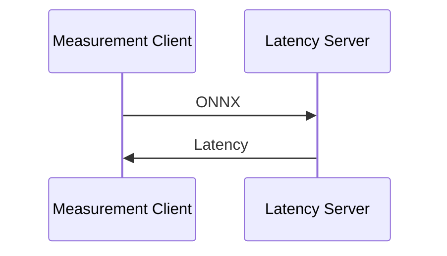
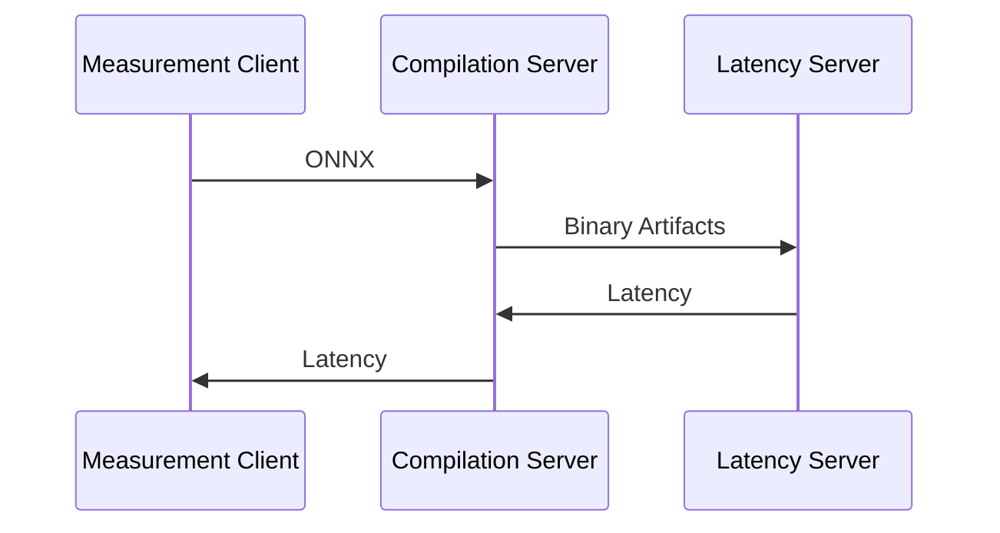

# Latency Server Texas Instruments TDA4-J721EXSKG01EVM

This README shows how to run latency measurements on Texas Instruments TDA4 (TI TDA4).

Measurement server is based on:

- [ONNX Runtime](https://onnxruntime.ai/) — cross-platform inference framework.
- [ENOT Latency Server](https://enot-autodl.rtd.enot.ai/en/latest/latency_server.html) — small open-source package that provides simple API for latency measurement.

Our server supports measurements on both NPU and CPU devices.
It creates an ONNX Runtime session for a desired ONNX model, runs `warmup` iterations before measurements, and then estimates model latency as an average time over `repeat * number` iterations.

### Latency measurement for TI CPU

The following steps are performed for latency measurement for TI CPU:

- Measurement client sends an ONNX model to device latency server.
- Latency server measures latency using the ONNX model and sends latency to measurement client.

This process is illustrated in the diagram below:



### Latency measurement for TI NPU

The following steps are performed for latency measurement for TI NPU:

- Measurement client sends an ONNX model to compilation server.
- Compilation server creates binaries from the ONNX model that are needed to run it on TI device and sends binaries to device latency server.
- Latency server measures latency using the binaries and sends latency to compilation server.
- Compilation server sends latency to measurement client.

This process is illustrated in the diagram below:



## Installation

### Installation of device latency server

⚠️ Further steps should be executed on the TI device.

Git LFS module should be installed on the TI device. To download, unpack, and install Git LFS module built for arm64, run the following commands:

```commandline
wget https://github.com/git-lfs/git-lfs/releases/download/v3.4.0/git-lfs-linux-arm64-v3.4.0.tar.gz
tar -xvf git-lfs-linux-arm64-v3.4.0.tar.gz
./git-lfs-3.4.0/install.sh
git lfs install
```

Now you can clone the repository and run the installation script:

```commandline
git clone https://github.com/ENOT-AutoDL/latency-server-ti-tda4-j721exskg01evm.git
cd latency-server-ti-tda4-j721exskg01evm
./install-on-device.sh
```

After installation is completed, a brief report will be provided, the server will be automatically
started and added to the system autoloader.

### Installation of compilation server

⚠️ Further steps should be executed on x86 PC (Linux OS).

Prerequisites requirements:

- Git
- [Git LFS](https://github.com/git-lfs/git-lfs?utm_source=gitlfs_site&utm_medium=installation_link&utm_campaign=gitlfs#installing)
- [Docker](https://docs.docker.com/engine/install/)

Clone the repository and build docker image for compilation server:

```commandline
git lfs install
git clone https://github.com/ENOT-AutoDL/latency-server-ti-tda4-j721exskg01evm.git
cd latency-server-ti-tda4-j721exskg01evm
docker build --shm-size 4G --tag ti-latency-server:latest -f docker/Dockerfile .
```

To ensure that installation was successful, run the compilation server:

```commandline
docker run -it --rm --shm-size 4G -e TI_HOST=<device-server-ip> -e TI_PORT=15003 -p <compilation-server-port>:15003 ti-latency-server
```

It is recommended to use port 15003 for the compilation server (`<compilation-server-port>`).

### Installation of measurement/compilation client

⚠️ Further steps should be executed on x86 PC (Linux OS). It is recommended to run the measurement client and
the compilation server on the same PC.

Prerequisite requirements:

- Git
- Python >= 3.8

Clone the repository and run installation:

```commandline
git clone https://github.com/ENOT-AutoDL/latency-server-ti-tda4-j721exskg01evm.git
cd latency-server-ti-tda4-j721exskg01evm
pip install .[minimal]
```

To ensure that installation was successful, run the measurement/compilation client:

```commandline
ti-measure-latency --help
```

```commandline
ti-remote-compiler --help
```

## Latency measurements on TI TDA4

To measure latency on TI TDA4 on NPU:

1. Run compilation server:

   ```commandline
   docker run -it --rm --shm-size 4G -e TI_HOST=<device-server-ip> -e TI_PORT=15003 -p <compilation-server-port>:15003 ti-latency-server
   ```

   It is recommended to use port 15003 for the compilation server (`<compilation-server-port>`).

1. Run a command for a single measurement:

   ```commandline
   ti-measure-latency --host <compilation-server-host> --port <compilation-server-port> -m <path-to-model-onnx>
   ```

To measure latency on TI TDA4 on CPU send measurement request directly to device:

```commandline
ti-measure-latency --host <device-server-host> --port 15003 -m <path-to-model-onnx>
```

## Compilation of ONNX model for TI TDA4

1. Run compilation server:

   ```commandline
   docker run -it --rm --shm-size 4G -e TI_HOST=<device-server-ip> -e TI_PORT=15003 -p <compilation-server-port>:15003 ti-latency-server
   ```

   It is recommended to use port 15003 for the compilation server (`<compilation-server-port>`).

1. Run a command for compilation:

   ```commandline
   ti-remote-compiler --host <compilation-server-host> --port <compilation-server-port> -m <path-to-model-onnx> -c <path-to-calibration-data-zip> -o <path-to-output-zip>
   ```

   After that command you will get a zip archive with compiled binaries that can be run on the device. You can find the
   prepared calibration data in `calibration_data/` directory in the repository.

   > **_NOTE:_** Calibration data is a zip archive with these properties:

   - Each calibration frame is represented by a file in the root of the archive.
   - A calibration frame file can have any name but must have the extension `.pickle`.
   - A calibration frame file is a pickled dict with keys representing the names of the model inputs and values representing calibration data (numpy array).
